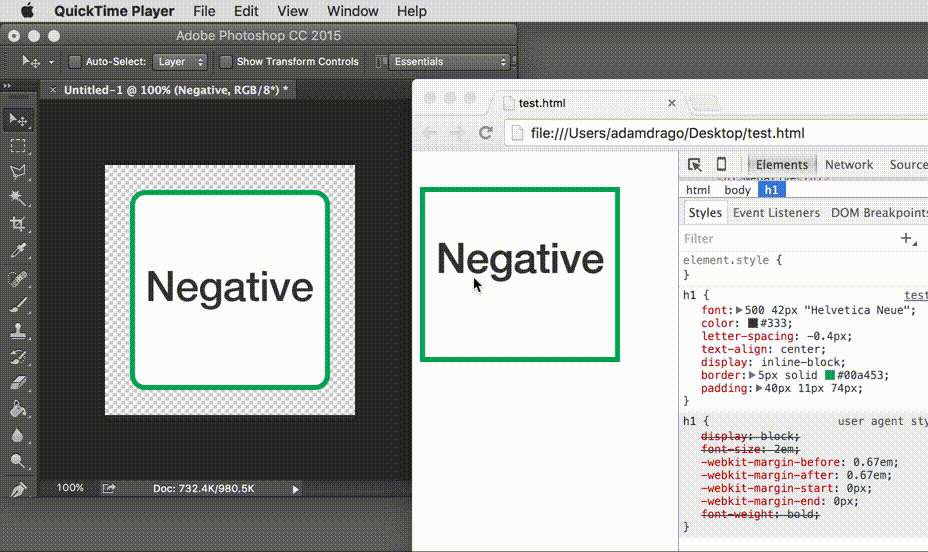

# Negative

> An app for making visual comparison.

## User Documentation

- [Usage](docs/usage.md)

## Build Negative.app

Currently only Mac OS X is supported.

1. [Install Node.js](https://nodejs.org/en/) v4 or v5
2. `git clone https://github.com/atdrago/negative.git`
3. `cd negative`
4. `npm install`
5. `npm run build`
6. Locate and copy `dist/Negative-darwin-x64/Negative.app` to your `Applications` folder

## Testing

*Important:* Tests gets run against the **built app**. If you are attempting to run tests and the results are not what you expected, you need to run `npm run build` again.

1. `npm run build`
2. `npm run test`

## Developing

### Compiling
- `gulp` - Compile, combine, and minify files for the renderer process. This isn't necessary for files in the main process.

### NPM Scripts
- `npm start` - Start the app with the following environment variables:
	- NODE_ENV=development
	- ELECTRON_ENABLE_LOGGING=true
- `npm run build` - Build the production app
	1. Compiles JavaScript and Sass
	2. Copies necessary files to `./release/`
	3. Runs `npm install --production` in `./release/`
	4. Builds the app moves it to `./dist/`
- `npm run lint` - Run ESLint
- `npm run test` - Run Mocha tests 

## Contributing
All contributions are welcome!! Please check [negative/issues](https://github.com/atdrago/negative/issues) for things that need attention, or feel free to create your own. Please make sure you create an issue *first*, and then do the work and a submit a PR. 

## About
Created by [Adam Drago](http://adamdrago.com). Icon by [Tiffany Wang](mailto:wangtiff@gmail.com). Built on [Electron](http://electron.atom.io/).
