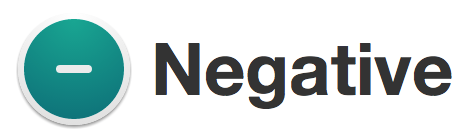
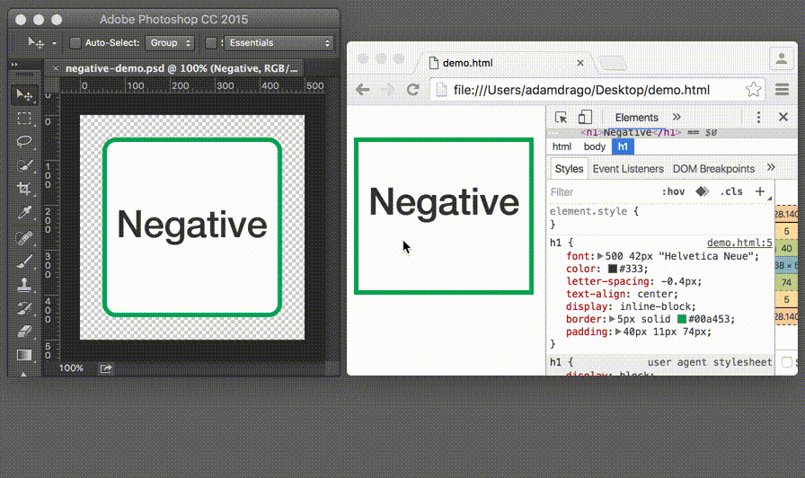

# 

> An app for making visual comparisons.

Follow [@NegativeJS](https://twitter.com/negativejs) on Twitter for important updates.

## Download
**Important Note:** Users running Negative v0.10.0 may experience an application crash when opening the Settings window. Negative v0.10.1 solves this issue. If the update did not download automatically, please download it manually from the link below. If automatic updates were enabled, it is very likely that v0.10.1 was automatically installed after the crash. Please check your version in "Negative > About Negative". If the version is v0.10.1 or higher, no further action is needed on your part. I apologize for any inconvenience this may have caused you. - Adam
- [Negative v0.10.1 for Mac OS X](https://github.com/atdrago/negative/releases/download/v0.10.1/Negative-v0.10.1.dmg)

## User Documentation
Please check [negative/releases](https://github.com/atdrago/negative/releases) for details on changes between versions.
- [Usage](docs/usage.md)

## Contributing
All contributions are welcome!! Please check [negative/issues](https://github.com/atdrago/negative/issues) for things that need attention, or feel free to create your own. Please make sure you create an issue *first*, and then do the work and a submit a PR. 

## Build Negative.app

Currently only Mac OS X is supported.

1. [Install Node.js](https://nodejs.org/en/) >= v6
2. `git clone https://github.com/atdrago/negative.git`
3. `cd negative`
4. `npm install`
5. `npm run build`
6. Locate and copy `dist/Negative-darwin-x64/Negative.app` to your `Applications` folder

## Testing

*Important:* Tests get run against the **built app**. If you are attempting to run tests and the results are not what you expected, you need to `npm run build` again.

1. `npm run build`
2. `npm test`

## Developing

### Compiling
- `gulp` - Compile, combine, and minify files for the renderer process. This isn't necessary for files in the main process. Make sure this is running when working on UI.

### NPM Scripts
- `npm start` - Start the app with the following environment variables:
	- NODE_ENV=development
	- ELECTRON_ENABLE_LOGGING=true
	- ELECTRON_ENABLE_STACK_DUMPING=true
- `npm run build` - Build the production app
	1. Compiles JavaScript and Sass
	2. Copies necessary files to `./release/`
	3. Runs `npm install --production` in `./release/`
	4. Builds the app moves it to `./dist/`
- `npm run lint` - Run ESLint
- `npm test` - Run Mocha tests 
- `npm run travis`
	1. Run `build`
	2. Run `test`
- `npm run open` - Starts the app from `dist/Negative-darwin-x64/Negative.app`
- `npm run dmg`
	1. Run `build`
	2. Move `dist/Negative-darwin-x64/Negative.app` to `dist/release/Negative.app`
	3. Create `dist/release/Negative.dmg`

## About
Created by [Adam Drago](http://adamdrago.com). Built on [Electron](http://electron.atom.io/).
