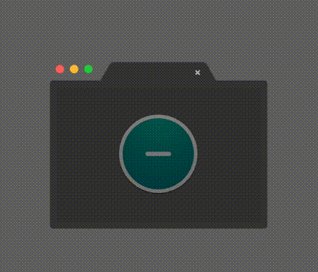
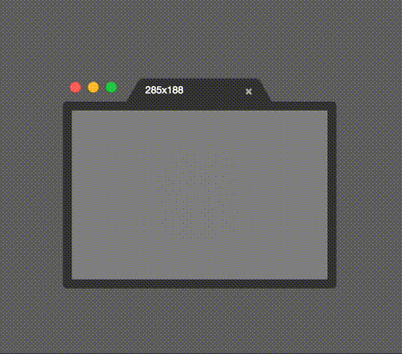
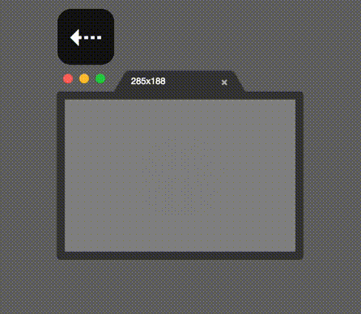
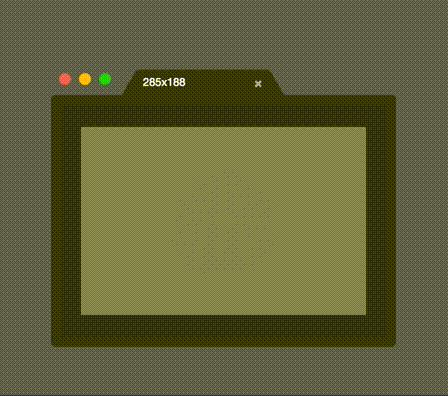
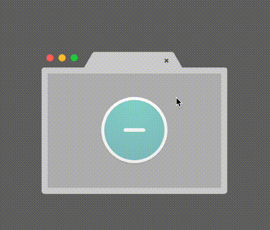

# Negative Guide

Negative is made for anybody who needs to compare two things on a computer screen. Whether you're a developer, designer, animator, or even just a normal user, you've probably needed to compare two "mockups", designs, browsers, simulators, or frames. Negative is a simple app that helps you do that.

[Download Negative](https://github.com/atdrago/negative/releases/latest)  
[Report a Problem](https://github.com/atdrago/negative/issues)

## Basic Usage
Negative is perfect for web developers. Below is an example of how it might be used for getting CSS pixel perfect.

## Capture / Clear
Capture the screen with `Command + G`, or clear the view with `Command + Delete`.

## Hide / Show (global)
Hide Negative **from any app** with `Command + Control + H`. Show it again with `Command + Control + H`.

## Move

### Arrow Keys
Use the arrow keys to nudge Negative by 1px in any direction. Hold down `Shift` to jump by 10px.

### Drag
Drag inside the view to move the window around. Currently, dragging on tabs will only rearrange them.

## Dark Mode / Light Mode
Sometimes it's easier to see the edge of your capture against a light-colored background. Use `Command + D` to toggle between Dark and Light modes.

## Tabs
Tabs. Because you need tabs.

## Zoom
> Zooming isn't really necessary yet because the captured image will always be resized to 1x dimensions. This feature is really just preparation for [allowing arbitrary images to be opened](https://github.com/atdrago/negative/issues/78) with Negative.

## Negative Shortcuts
| Keys                                 | Function                             |
|--------------------------------------|--------------------------------------|
| Arrow Keys                           | Move the Window 1px                  |
| Shift + Arrow Keys                   | Move the Window 10px                 |
| Command + G                          | Take a Screenshot                    |
| Command + D                          | Dark Mode                            |
| Command + F                          | Fit Window to Image                  |
| Command + T                          | New Tab                              |
| Command + W                          | Close Tab                            |
| Command + }                          | Next Tab                             |
| Command + {                          | Previous Tab                         |
| Command + Shift + }                  | Next Tab and Resize                  |
| Command + Shift + {                  | Previous Tab and Resize              |
	
## Global Shortcuts
*Note: These shortcuts are "global", meaning they can be used from any app*

| Keys                                 | Function                             |
|--------------------------------------|--------------------------------------|
| Command + Control + H                | Hide or show Negative (from any app) |
